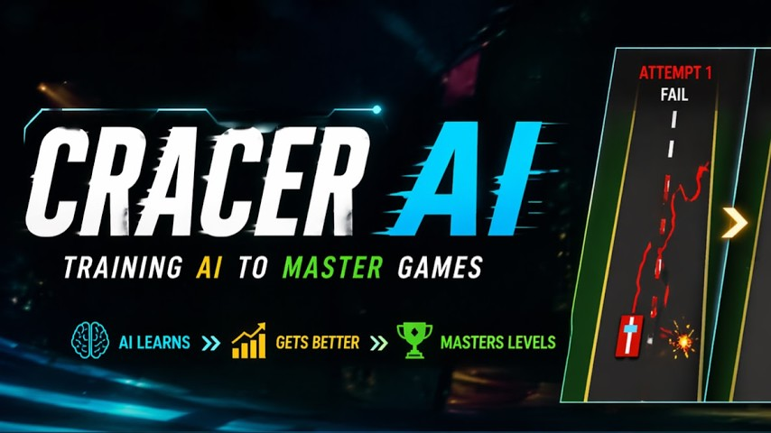

# rl-game

This repo is for building game simulations for RL agents and training them to play the games and discover the best winning patterns.

---

## [Cracer Simulation](cracer-simulation/)

A RL agent learns and plays car racing game.

**YouTube — Training Progress & Demos:**

See [`cracer-simulation/rl/README.md`](cracer-simulation/rl/README.md) for full training and inference documentation.
